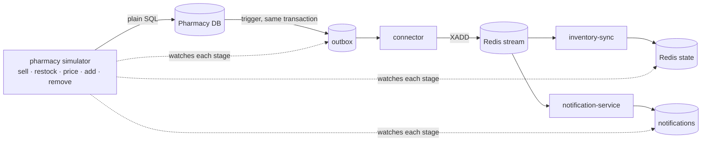

# Pharmacy simulator (milestone 12)

A tool that behaves like pharmacy software, so the whole event-driven synchronisation can be **demonstrated live**:
change a pharmacy's stock, and watch the change travel through every stage of MedLink until MedLink's copy
matches the pharmacy's own database.



The simulator **writes only to the pharmacy's own database**, the way real pharmacy software would, and knows nothing
about MedLink. It never touches Redis to make a change. The pharmacy schema's trigger records the event, and the real
connector, sync service and notification service carry it from there. What the simulator adds is a way to *watch*.

## Run it

First time (databases, starting stock, and the starting stock sent to Redis):

```
npm run infra:up
npm run db:migrate && npm run db:seed
npm run pharmacies:setup        # or pharmacies:reset, to go back to the starting stock
```

**One command, everything in one terminal** (connectors, sync service and notification service run inside the
simulator, built from the same classes as the real ones):

```
npm run demo                    # the guided walk-through, then exits
npm run simulator -- --embedded # an interactive shell
```

**The real thing**, each service in its own terminal, the simulator only watching:

```
npm run connector:start     npm run sync:start     npm run notify:start
npm run simulator -- demo   # or: npm run simulator   for the shell
```

One-shot commands work too, and exit non-zero if the change did not get through:

```
npm run simulator -- sell P001 crocin 2
```

## The demo

`demo` runs on Pharmacy D, which starts with no Crocin 500mg, and ends by proving the two sides agree:

```
1. Crocin 500mg is out of stock at Pharmacy D           (sells what is left, if anything)
2. Asha asks to be told when it is back in stock        notify asha@example.com M001
3. The pharmacy receives a delivery of 30 strips        restock P004 M001 30
     ✓ recorded in the pharmacy's outbox              +0 ms   RESTOCK
     ✓ published to the Redis stream                  +54 ms
     ✓ applied to MedLink's Redis state               +112 ms
     ✓ notification sent: asha@example.com            +112 ms
4. A customer buys 2                                    sell P004 M001 2
5. The pharmacy raises the price by 10%                 price P004 M001 ...
6. The pharmacy starts stocking another medicine        add P004 M008 20 ...
7. Is MedLink's copy the same as the pharmacy's own database?
     ✓ P004: all 15 medicines agree
```

It can be run again and again: it empties the shelf first, and if an earlier run added the new medicine it removes it
first. It stops at the first change that does not get through and says which service to start.

## See it in the app

The same changes show up in the web app. With the API (`npm run api:dev`) and the web app (`npm run web:dev`) running,
open a search for a medicine, then `sell` it out with the simulator: within a second or two the result flips to
"Out of stock" (marked **Live**), the "Notify me" panel and same-ingredient alternatives appear, and a `restock`
brings the pharmacy back and sends the simulated notification to the bell in the header. See `docs/frontend.md`.

## Commands

| Command | Does |
|---|---|
| `sell <pharmacy> <medicine> <qty>` | Takes units off the shelf. Cannot sell more than is there. Records a `SALE`. |
| `restock <pharmacy> <medicine> <qty>` | A delivery of a medicine the pharmacy carries. Records a `RESTOCK`. |
| `price <pharmacy> <medicine> <price>` | New price. The same price records nothing. Records `PRICE_UPDATED`. |
| `add <pharmacy> <medicine> <qty> <price>` | Starts stocking a catalogue medicine the pharmacy does not carry. `MEDICINE_ADDED`. |
| `remove <pharmacy> <medicine>` | Stops stocking it. `MEDICINE_REMOVED`. (Not in the milestone; it makes the demo repeatable and exercises the last event type.) |
| `notify <email> <medicine>` | A user asks to be told when it is back in stock (writes what the API would, to the central database). |
| `show [pharmacy]` | The pharmacy's stock next to MedLink's copy. |
| `verify [pharmacy]` | Waits until the two agree and says so, or lists what differs. |
| `list`, `help`, `demo`, `exit` | |

A pharmacy is `P001` to `P005`; a medicine is a code (`M001`) or a brand name (`crocin`).

## What the trace shows, and where it comes from

Nothing is simulated or assumed; each line is read from the system itself:

| Stage | Seen when |
|---|---|
| recorded in the pharmacy's outbox | the transaction that made the change commits (the event id is read back from it) |
| published to the Redis stream | the outbox row gets `published_at`: the connector's `XADD` succeeded |
| applied to MedLink's Redis state | the dedup marker for the event id is `done`: inventory-sync applied it |
| notification sent | a `notifications` row exists for the event id (only for a restock someone was waiting for) |

The times are measured from the commit. With the real connector they include its poll interval
(`CONNECTOR_POLL_INTERVAL_MS`, 1 s by default), so about 1 s is normal there, and about 50 ms embedded.

If an event sits at a stage for a few seconds, the simulator says what is probably not running, for example
`not published yet: is the inventory connector running? (npm run connector:start)`. The change is not lost: it is
already in the pharmacy's database and outbox, and arrives when the service starts (tested for each service).

## The proof

`verify` compares the pharmacy's own database with MedLink's Redis state, medicine by medicine, quantity and price
(a medicine the pharmacy does not carry must not be in Redis either). The test suite uses the same comparison after a
mix of changes on all five pharmacies, and shows it **detects** a difference (connector stopped, then the stock
differs) and **converges** once the service is back.

## Limits worth knowing

* **Redis is built from events.** Events already published are not sent again, so a Redis that was wiped (or a new
  `REDIS_KEY_PREFIX`) has no record of stock that did not change since. `verify` says exactly that instead of calling it a
  sync error; `npm run pharmacies:reset` reloads the starting stock and sends it. A reconcile from the pharmacy
  databases would close this properly and is not built.
* **Medicines come from the MedLink catalogue** (`M001` to `M015`): `add` refuses anything else, because MedLink
  could not show it.
* **`notify` writes to the central database directly**, standing in for the user's app, so the simulator needs
  `DATABASE_URL` for the notification part. Without it the demo skips that step.
* **A restock is traced to the notification only when someone was waiting.** The simulator counts the waiting
  users before the change, since the pipeline may notify them within milliseconds.
* `SIM_TRACE_TIMEOUT_MS` (default 15000) is how long a change is followed before giving up.

## Tests

`apps/pharmacy-simulator/test`:

* `simulator.test.ts`: each operation and its event, refusals that record nothing, concurrent sales that can never
  oversell, each call getting back only its own event.
* `flow.test.ts`: against the real pipeline: every stage in order, the notification, a stopped connector, sync service
  or notification service named and caught up on restart, a parked event, the agree/differ proof, every shell
  command and refusal, and the demo end to end (including running it three times in a row, and with nothing running).
