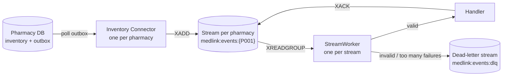
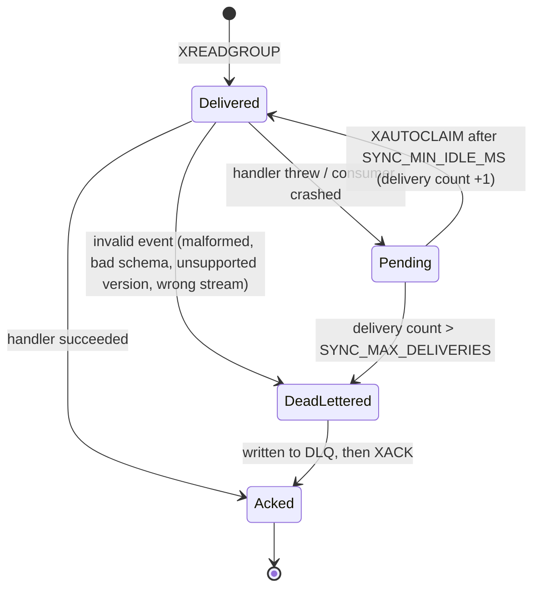

# Redis Streams: event transport and consumer-group design

This describes what is implemented today (milestones 7 to 10). The sync service **receives, validates, de-duplicates,
acknowledges and reports on** events, and **applies them to a current-state model in Redis** (stock and price per
pharmacy and medicine). It runs against a single Redis or a Redis Cluster (see "Redis Cluster").

## Keys

| Key | Type | Purpose |
|---|---|---|
| `medlink:events:{P001}` | stream | One per pharmacy. Each entry has one field, `event`, holding the JSON `InventoryEvent`. |
| `medlink:streams` | set | Registry of stream keys. Connectors add to it; the sync service reads it to discover pharmacies. |
| `medlink:events:dlq` | stream | Events that could not be processed, with the reason and the original payload. |
| `medlink:sync:{P001}` | hash | Per-pharmacy status: last event, last sync time, latency, processed / duplicate / applied / stale counts. |
| `medlink:dedup:{P001}:<eventId>` | string | Duplicate marker, `processing` or `done` (see "Duplicate protection"). |
| `medlink:inventory:{P001}:M001` | hash | Current state of one medicine at one pharmacy (see "Current state"). |
| `medlink:inventory:{P001}:index` | set | Medicine ids the pharmacy currently lists. |
| `medlink:medicine:{M001}:pharmacies` | set | Pharmacies that may stock a medicine (a hint, see "Looking up a medicine"). |

`medlink` is a configurable prefix (`REDIS_KEY_PREFIX`). The pharmacy code is a Redis hash tag (`{P001}`), so in Redis
Cluster all keys of one pharmacy hash to the same slot. Key names live in one place:
`packages/event-schema/src/streams.ts`.

## Why one stream per pharmacy

* **Ordering.** Entries in a stream are ordered; with one stream per pharmacy, each pharmacy's events are read in the
  order they were written.
* **Fault isolation.** Each stream has its own worker. A pharmacy whose events keep failing never delays another
  pharmacy (covered by a test).
* **Cluster friendly.** Streams spread across shards instead of one hot key.
* **Cost.** One blocking connection per stream. Fine for tens or hundreds of pharmacies; for thousands, switch to a
  fixed number of partition streams (`hash(pharmacyId) % N`). Only `eventStreamKey()` and the discovery code change.

## Consumer group

All sync instances join the group `inventory-sync` on every stream. Redis delivers each entry to exactly one consumer
of the group, so running several instances shares the work.

* The group is created at stream position `0`, so events written **before** the service first ran are not skipped.
* New entries: `XREADGROUP ... BLOCK ... STREAMS <key> >`.
* An entry is **acknowledged (`XACK`) only after it was fully handled**, never before.

### What happens to an entry

| Situation | Behaviour |
|---|---|
| Handler succeeds | `XACK`. |
| Handler throws (e.g. a transient error) | Not acknowledged. After `SYNC_MIN_IDLE_MS` the entry is re-claimed and retried. |
| Consumer crashes mid-processing | The entry stays pending. Any instance re-claims it after `SYNC_MIN_IDLE_MS`. Nothing is lost. |
| Event is malformed / invalid / unsupported version / in the wrong pharmacy's stream | Retrying cannot help: dead-lettered at once, acknowledged. |
| Fails `SYNC_MAX_DELIVERIES` times | Dead-lettered with code `MAX_DELIVERIES`, acknowledged, so it stops blocking. |
| Entry trimmed from the stream while pending | Acknowledged and skipped. |

A dead-letter entry records `stream`, `entryId`, `code`, `reason`, the original `payload` and `deadAt`.

## Delivery guarantees

* **Connector to Redis: at-least-once.** A row leaves the pharmacy outbox only after `XADD` succeeded. A crash between
  `XADD` and marking the row published sends the same event again, with the same `eventId`.
* **Redis to handler: at-least-once.** Retries and crash take-over can deliver an entry more than once.
* Therefore **handlers must tolerate duplicates**. Milestone 8 adds `DedupHandler`, which wraps any handler and
  skips events whose `eventId` was already handled (see "Duplicate protection").
* **Ordering** holds per pharmacy for first deliveries. A retried entry can be processed after later entries.

## Duplicate protection (milestone 8)

`DedupHandler` keeps one marker per event, `medlink:dedup:{P001}:<eventId>`, in two states:

| State | Written | Lifetime | Meaning |
|---|---|---|---|
| `processing` | before the handler runs | lease, `SYNC_DEDUP_LEASE_MS` (30 s) | one delivery is handling it; expires by itself if that consumer dies |
| `done` | only after the handler succeeded | `SYNC_DEDUP_RETENTION_HOURS` (168 h) | handled; later deliveries are acknowledged and skipped |

| Delivery finds | Behaviour |
|---|---|
| no marker | take the lease, run the handler, write `done`, `XACK` |
| `done` | skip, count in `duplicateCount` of `medlink:sync:{P001}`, `XACK` |
| `processing` | throw `EventInFlightError`; not acknowledged, retried after `SYNC_MIN_IDLE_MS` |
| handler throws | lease released so the retry runs at once; entry retried as before |

Marking `done` *before* handling (plain `SET NX`) was rejected: a crash right after it would make every retry look
like a duplicate and the event would be lost. Take care that `SYNC_DEDUP_LEASE_MS` stays below
`SYNC_MIN_IDLE_MS * SYNC_MAX_DELIVERIES`, otherwise a crashed consumer's event can be dead-lettered while its lease
is still held.

**Retention must be longer than any way a duplicate can still arrive**: outbox republish after a connector crash,
retry of a pending entry, and stream retention. After that window an old `eventId` is treated as new.

**The marker and the state change are one atomic step.** `InventoryStateHandler` declares `commitsDedupMarker`, so
`DedupHandler` passes it the marker key and retention and does not write `done` itself. The state script applies the
change and sets `done` together (and refuses an event whose marker is already `done`), so a crash can never leave a
change applied but unmarked, or marked but not applied. A handler without that flag still gets the old two-step
behaviour, with the small crash window described above.

## Current state (milestone 9)

`InventoryStateHandler` keeps one hash per medicine per pharmacy, `medlink:inventory:{P001}:M001`:

| Field | Meaning |
|---|---|
| `quantity` | the pharmacy's own `quantityAfter` from the last event that decided it (never "old quantity + delta") |
| `quantityTs` | time (epoch ms) of that event |
| `price`, `priceTs` | same for the price |
| `removed` | `1` after `MEDICINE_REMOVED` |
| `lastEventId`, `medicineId` | bookkeeping |

Reading: `getItem(pharmacyId, medicineId)` and `listItems(pharmacyId)`.

**Order.** Retries and take-over mean an older event can arrive after a newer one, so the last *arrival* does not
win; the last *event time* does:

* An event changes a field only if its time is not older than the field's stored time. Quantity and price are judged
  separately, so a late price update is not blocked by a newer sale (and an older price still loses to a newer one).
* Because `quantityAfter` is stored instead of applying deltas, a lost or reordered event heals itself with the next one.
* A removed medicine is a tombstone: only a newer `MEDICINE_ADDED` brings it back. Older or newer sales, restocks and
  price updates are ignored while it is removed.
* Events with exactly equal times: the later arrival wins.
* The result is the same for any arrival order of the same events (tested with several orderings).

A stale event is still marked `done` (so it is not re-evaluated on every retry) and counted in `staleCount`; applied
ones in `appliedCount`, both in `medlink:sync:{P001}`.

### Looking up a medicine across pharmacies

`pharmaciesWithMedicine("M001")` returns every pharmacy that lists the medicine, with its quantity and price.

The index behind it, `medlink:medicine:{M001}:pharmacies`, is hash-tagged by the *medicine*, so it lives in a
different slot than the pharmacy keys and **cannot be part of the atomic script**. It is therefore only a hint
("may stock"); the pharmacy's own item hash is the truth. The rules that keep it safe:

* It is written **before** the state change, so a crash can leave an extra entry but never a missing one. A redelivery
  repeats the (idempotent) `SADD`.
* Entries are **never removed** on the write path. A removal racing with a newer re-add on another consumer could
  otherwise drop a real entry. Readers look at each pharmacy's item and skip removed or unknown ones.
* The cost is one read per pharmacy in the set, each in its own slot. The set only grows (pharmacies x medicines
  they ever stocked), which is small; it can be rebuilt from the pharmacy indexes if it is ever lost.

## Redis Cluster (milestone 10)

Set `REDIS_MODE=cluster` and `REDIS_CLUSTER_NODES=host:port,...` (seed nodes; one reachable node is enough) and the
connector and sync service use an ioredis `Cluster` client. Without it they use `REDIS_URL` as before. No handler
code differs between the two.

**Why it works without changes.** Every key of one pharmacy carries the hash tag `{P001}`: its stream, status, dedup
markers, item hashes and index. They share one slot, so the Lua scripts (dedup lease, state change plus marker) are
legal on a cluster, and a pharmacy's events stay in order on one shard. Different pharmacies spread over the shards.
Single-key operations on shared keys (`medlink:streams`, `medlink:events:dlq`) are fine too, but each lives on one
shard, so the dead-letter stream is not sharded.

**Local cluster.** `npm run cluster:up` starts 3 masters and 3 replicas (ports 7001 to 7006) and creates the
cluster; running it again is harmless. `npm run cluster:down` removes the containers (data volumes are kept).
Nodes announce their service name (`redis-node-1:7001`), which only the compose network can resolve, so from the
host set `REDIS_CLUSTER_NAT=local`: it maps those names to `127.0.0.1:700x`. Against a real cluster that announces
reachable addresses, leave it unset.

**Tests.** `npm run test:cluster` runs the whole suite against the cluster (the same tests, plus
`apps/inventory-sync/test/cluster.test.ts`: one slot per pharmacy, pharmacies spread over several masters, a script
mixing slots is rejected). `npm test` keeps using the standalone Redis.

**Verified live (failover).** Sync service running against the cluster, 300 events published over 5 pharmacies, and
node-1 (a master holding three of them) stopped one second in. Its replica was promoted, the producer stalled about
9 s and retried 26 times, and all 300 events were applied: correct final stock for every pharmacy, nothing
dead-lettered. The stopped node came back as a replica. Duplicate deliveries did not occur in that run, so the
dedup path under failover is covered by the dedup tests, not by this run.

**Things to know.**

* A cluster client cannot run multi-key commands across slots: `KEYS`, multi-key `DEL`, cross-pharmacy
  `MULTI`. Use `scanKeys` / `deleteAll` from `@medlink/redis`, which scan every master and delete key by key.
* During a failover, commands to the affected shard fail or wait until a replica is promoted (about 5 to 10 s with
  `cluster-node-timeout 5000`). The sync service keeps retrying; the connector fails fast and keeps events in the
  outbox, as it does when Redis is down.
* Replication is asynchronous: a master that dies can lose its last acknowledged writes before the replica has
  them. For events this is the same at-least-once story as before (the outbox row is only marked published after
  `XADD`, but an `XADD` lost with a dying master was acknowledged). Closing it needs `WAIT` or a reconcile from the
  pharmacy databases; neither is done yet.

## Failure behaviour (verified)

| Failure | Result |
|---|---|
| Redis down | Connector publishes fail fast; events stay in the pharmacy outbox and the connector retries with backoff. The pharmacy database keeps working. The sync service keeps reconnecting. On recovery everything is delivered. Tested live: stop Redis, sell, start Redis, event delivered and acknowledged, nothing dead-lettered. |
| Redis restarts | Redis runs with AOF (`appendonly yes`, fsync every second), so streams and the consumer group survive. At most about one second of accepted writes can be lost on a hard crash. |
| Sync service down | Events accumulate in the streams and are processed when it returns. |
| Sync service stop while Redis is down | `stop()` waits at most `shutdownTimeoutMs`, because consumer commands retry forever. |

## Limits worth knowing

* Streams are capped with approximate trimming (`MAXLEN ~ 100000` per pharmacy). Entries are not removed when
  acknowledged. If a consumer stays down long enough for a pharmacy to write more than that, the oldest unprocessed
  events are lost. Monitor consumer lag (milestone 13).
* The retry delay is `SYNC_MIN_IDLE_MS` (default 10 s); there is no exponential backoff per entry.
* Registry discovery polls every 3 s, so a brand-new pharmacy is picked up within about that time.
