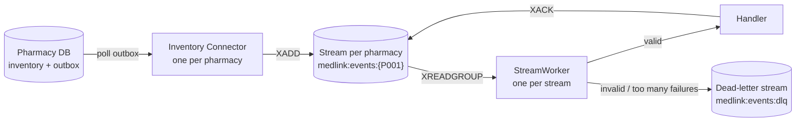
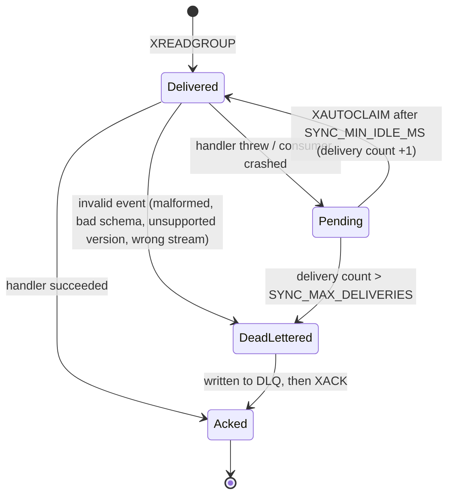

# Redis Streams: event transport and consumer-group design

This describes what is implemented today (milestone 7). The sync service **receives, validates, acknowledges and
reports on** events. It does **not** yet apply them to inventory state: that needs duplicate protection first
(milestone 8, now added as `DedupHandler`) and then the Redis current-state model (milestone 9).

## Keys

| Key | Type | Purpose |
|---|---|---|
| `medlink:events:{P001}` | stream | One per pharmacy. Each entry has one field, `event`, holding the JSON `InventoryEvent`. |
| `medlink:streams` | set | Registry of stream keys. Connectors add to it; the sync service reads it to discover pharmacies. |
| `medlink:events:dlq` | stream | Events that could not be processed, with the reason and the original payload. |
| `medlink:sync:{P001}` | hash | Per-pharmacy status: last event, last sync time, latency, processed count. |

`medlink` is a configurable prefix (`REDIS_KEY_PREFIX`). The pharmacy code is a Redis hash tag (`{P001}`), so in Redis
Cluster (milestone 10) all keys of one pharmacy hash to the same slot. Key names live in one place:
`packages/event-schema/src/streams.ts`.

## Why one stream per pharmacy

* **Ordering.** Entries in a stream are ordered; with one stream per pharmacy, each pharmacy's events are read in the
  order they were written.
* **Fault isolation.** Each stream has its own worker. A pharmacy whose events keep failing never delays another
  pharmacy (covered by a test).
* **Cluster friendly.** Streams spread across shards instead of one hot key.
* **Cost.** One blocking connection per stream. Fine for tens or hundreds of pharmacies; for thousands, switch to a
  fixed number of partition streams (`hash(pharmacyId) % N`). Only `eventStreamKey()` and the discovery code change.

## Consumer group

All sync instances join the group `inventory-sync` on every stream. Redis delivers each entry to exactly one consumer
of the group, so running several instances shares the work.

* The group is created at stream position `0`, so events written **before** the service first ran are not skipped.
* New entries: `XREADGROUP ... BLOCK ... STREAMS <key> >`.
* An entry is **acknowledged (`XACK`) only after it was fully handled**, never before.

### What happens to an entry

| Situation | Behaviour |
|---|---|
| Handler succeeds | `XACK`. |
| Handler throws (e.g. a transient error) | Not acknowledged. After `SYNC_MIN_IDLE_MS` the entry is re-claimed and retried. |
| Consumer crashes mid-processing | The entry stays pending. Any instance re-claims it after `SYNC_MIN_IDLE_MS`. Nothing is lost. |
| Event is malformed / invalid / unsupported version / in the wrong pharmacy's stream | Retrying cannot help: dead-lettered at once, acknowledged. |
| Fails `SYNC_MAX_DELIVERIES` times | Dead-lettered with code `MAX_DELIVERIES`, acknowledged, so it stops blocking. |
| Entry trimmed from the stream while pending | Acknowledged and skipped. |

A dead-letter entry records `stream`, `entryId`, `code`, `reason`, the original `payload` and `deadAt`.

## Delivery guarantees

* **Connector to Redis: at-least-once.** A row leaves the pharmacy outbox only after `XADD` succeeded. A crash between
  `XADD` and marking the row published sends the same event again, with the same `eventId`.
* **Redis to handler: at-least-once.** Retries and crash take-over can deliver an entry more than once.
* Therefore **handlers must tolerate duplicates**. Milestone 8 adds `DedupHandler`, which wraps any handler and
  skips events whose `eventId` was already handled (see "Duplicate protection").
* **Ordering** holds per pharmacy for first deliveries. A retried entry can be processed after later entries.

## Duplicate protection (milestone 8)

`DedupHandler` keeps one marker per event, `medlink:dedup:{P001}:<eventId>`, in two states:

| State | Written | Lifetime | Meaning |
|---|---|---|---|
| `processing` | before the handler runs | lease, `SYNC_DEDUP_LEASE_MS` (30 s) | one delivery is handling it; expires by itself if that consumer dies |
| `done` | only after the handler succeeded | `SYNC_DEDUP_RETENTION_HOURS` (168 h) | handled; later deliveries are acknowledged and skipped |

| Delivery finds | Behaviour |
|---|---|
| no marker | take the lease, run the handler, write `done`, `XACK` |
| `done` | skip, count in `duplicateCount` of `medlink:sync:{P001}`, `XACK` |
| `processing` | throw `EventInFlightError`; not acknowledged, retried after `SYNC_MIN_IDLE_MS` |
| handler throws | lease released so the retry runs at once; entry retried as before |

Marking `done` *before* handling (plain `SET NX`) was rejected: a crash right after it would make every retry look
like a duplicate and the event would be lost. Take care that `SYNC_DEDUP_LEASE_MS` stays below
`SYNC_MIN_IDLE_MS * SYNC_MAX_DELIVERIES`, otherwise a crashed consumer's event can be dead-lettered while its lease
is still held.

**Retention must be longer than any way a duplicate can still arrive**: outbox republish after a connector crash,
retry of a pending entry, and stream retention. After that window an old `eventId` is treated as new.

**Known gap:** the marker and the handler's own writes are separate Redis calls. A crash between them can run the
handler twice for that one event. Closing it needs the marker written in the same atomic step as the state change,
which the current-state model (milestone 9) will do.

## Failure behaviour (verified)

| Failure | Result |
|---|---|
| Redis down | Connector publishes fail fast; events stay in the pharmacy outbox and the connector retries with backoff. The pharmacy database keeps working. The sync service keeps reconnecting. On recovery everything is delivered. Tested live: stop Redis, sell, start Redis, event delivered and acknowledged, nothing dead-lettered. |
| Redis restarts | Redis runs with AOF (`appendonly yes`, fsync every second), so streams and the consumer group survive. At most about one second of accepted writes can be lost on a hard crash. |
| Sync service down | Events accumulate in the streams and are processed when it returns. |
| Sync service stop while Redis is down | `stop()` waits at most `shutdownTimeoutMs`, because consumer commands retry forever. |

## Limits worth knowing

* Streams are capped with approximate trimming (`MAXLEN ~ 100000` per pharmacy). Entries are not removed when
  acknowledged. If a consumer stays down long enough for a pharmacy to write more than that, the oldest unprocessed
  events are lost. Monitor consumer lag (milestone 13).
* The retry delay is `SYNC_MIN_IDLE_MS` (default 10 s); there is no exponential backoff per entry.
* Registry discovery polls every 3 s, so a brand-new pharmacy is picked up within about that time.
