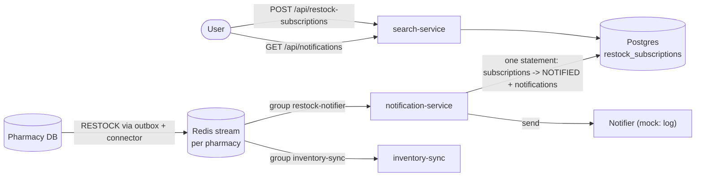

# Restock notifications (milestone 11)

A user who finds a medicine out of stock can ask to be told when it is back. When a pharmacy restocks it, the user gets
a **simulated** notification.



## What happens

1. **Subscribe.** The web app offers "Notify me when it's back" for a medicine that is out of stock at every pharmacy
   in the results. `POST /api/restock-subscriptions {email, medicineId}` stores it as `ACTIVE`.
2. **Detect.** `notification-service` reads the same per-pharmacy streams as `inventory-sync`, through its own consumer
   group (`restock-notifier`), so each service gets every event and neither slows the other. `detectRestock` accepts a
   `RESTOCK` event that leaves stock (`quantityAfter > 0`). Sales, price changes, additions and removals are ignored.
3. **Fulfil.** One SQL statement turns every `ACTIVE` subscription for that medicine into `NOTIFIED` and stores one
   `notifications` row for it. Atomic: a subscription is either still waiting, or notified with its notification stored.
4. **Send.** The stored notification is handed to a `Notifier`. The mock one writes
   `[mock notification] Crocin 500mg is back in stock at Pharmacy A (15 available).` to the log and the row gets
   `delivered_at`. The user also sees it through `GET /api/notifications?email=` (the web app polls it).

## Guarantees

| Situation | Result |
|---|---|
| The same restock event is delivered twice (connector crash, retry, two instances at once) | Notified once. Only `ACTIVE` subscriptions are taken and the row is locked while it is flipped; `notifications.subscription_id` is `UNIQUE` as a last line of defence. Tested with six concurrent callers. |
| An old restock is replayed after the user subscribed (stream backlog, service down, a new consumer group reads from the start) | Not notified. Only subscriptions created at or before the event's time are fulfilled, so nobody is told about a restock that happened before they asked (the shelf may be empty again). They keep waiting for the next one. |
| The notification channel is down | The notification stays stored with `delivered_at IS NULL` and the event is **not** retried (nothing is left to fulfil). A sweep every `NOTIFY_SWEEP_INTERVAL_MS`, and one at startup, sends what is pending. |
| Crash after storing, before sending | Same: the sweep sends it after the restart. |
| Crash after sending, before `delivered_at` is saved | Sent again. Delivery is **at-least-once**; harmless for the mock, a real channel would need its own idempotency key (the notification id). |
| Several notification-service instances | Fine: events are shared by the consumer group, and sending locks rows with `FOR UPDATE SKIP LOCKED`, so none is sent twice. |
| The database is down while handling a restock | The event is left unacknowledged and retried, then dead-lettered after `NOTIFY_MAX_DELIVERIES` attempts. Retrying is safe (see the first row). |
| User subscribes twice while waiting | One subscription (`200`, same id). After it was fulfilled or cancelled, asking again creates a new one. |
| User cancels | `DELETE /api/restock-subscriptions/:id?email=`. A cancelled subscription is never notified. |

## API

| Request | Result |
|---|---|
| `POST /api/restock-subscriptions` `{email, medicineId}` | `201` new, `200` already waiting, `404` unknown medicine, `400` bad input. |
| `GET /api/restock-subscriptions?email=` | The user's subscriptions, newest first. |
| `DELETE /api/restock-subscriptions/:id?email=` | Cancels a waiting one. `404` if it is unknown, not theirs, or no longer waiting (same answer, so ids cannot be probed). |
| `GET /api/notifications?email=&limit=` | The user's notifications, newest first (default 20, at most 100). |

## Running it

```
npm run db:migrate        # adds restock_subscriptions and notifications (migration 003)
npm run notify:start      # the notification service (needs DATABASE_URL and Redis, see .env.example)
```

It runs next to `connector:start` and `sync:start` and works against a single Redis or the cluster
(`REDIS_MODE=cluster`, see `docs/redis-streams.md`).

## Decisions and limits

* **Identity is an email.** There is no sign-in, so the email in the request *is* the user: it is created in `users`
  on first use, and anyone who knows an address can read or cancel its subscriptions. Fine for simulated
  notifications; real delivery needs real authentication first.
* **A subscription is for a medicine, not for a pharmacy.** Any pharmacy's restock fulfils it. The message names the
  pharmacy and the quantity.
* **The API does not check that the medicine is really out of stock.** The web app only offers the button when it is.
  Checking in the API would need one trusted source of "available", see the next point.
* **Search still reads the central Postgres `inventory`, which events do not update yet.** So after a restock the user
  is notified, but the search results keep showing the old stock until the central database (or a later milestone's
  Redis-backed search) catches up. The notification comes from the pharmacy's own event, not from that table.
* **The event's time is the pharmacy's clock** and is compared with the subscription's creation time in the central
  database. A pharmacy whose clock runs far behind could miss a subscriber made in that gap; they are notified at the
  next restock.
* **`MEDICINE_ADDED` with stock** (a medicine newly listed) is not treated as a restock. Adding it to `detectRestock`
  is a one-line change if it should notify.
* **A restock is reported as it happened.** If it sells out again before the notification is sent (a long outage),
  the user is still told it was restocked.

## Tests

* `apps/notification-service/test`: detector, the SQL (exactly-once, concurrency, old events, delivery sweep) and the
  service on real Redis streams (second consumer group, duplicate events, backlog replay, a channel that is down).
* `apps/search-service/test/notifications.test.ts`: the API.
* `tests/restock-notifications.test.ts`: the acceptance path with nothing mocked between the stages: subscribe over
  HTTP, restock in the pharmacy database, connector, Redis stream, notification service, read the notification over HTTP.
* `apps/web/src/lib`: the client calls and the "which medicines to offer" rule.
